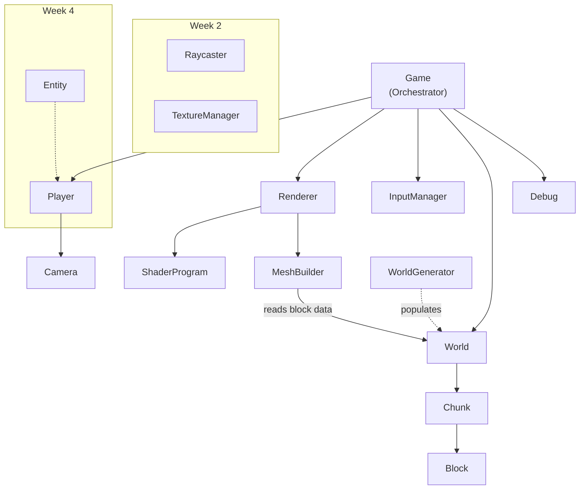

# Eden City — Implementation Plan (v3 Final)

A futuristic voxel exploration game. **C++17, OpenGL 3.3 Core, freeglut, GLAD, GLM.**

---

## Architecture

### Design Principles
- **Two-layer separation**: Game logic (World, Chunk, Player, Camera) never calls OpenGL. Rendering layer (Renderer, ShaderProgram, MeshBuilder) owns all GPU interaction.
- **No singletons/globals**: Everything is owned and passed explicitly.
- **Single responsibility**: Each class does one thing well.

### Class Diagram



### Class Responsibilities

| Class | Layer | Responsibility |
|---|---|---|
| **Game** | Core | Main loop, delta-time, owns all subsystems |
| **Renderer** | Rendering | OpenGL state, draws world/HUD. **Only class that calls GL** (besides ShaderProgram/MeshBuilder) |
| **ShaderProgram** | Rendering | Load, compile, link GLSL shaders. Uniform helpers |
| **MeshBuilder** | Rendering | Converts Chunk block data → VBO/VAO mesh. Handles face culling (skip faces adjacent to solid blocks). Keeps Renderer focused on drawing, not geometry generation |
| **Camera** | Logic | Position, yaw, pitch → view matrix via `glm::lookAt()`. No GL calls |
| **Player** | Logic | Owns Camera. WASD, gravity, jumping, collision (queries World) |
| **World** | Logic | Owns Chunks. Spatial queries: `isSolidAt()`, `getBlockAt()`. No generation logic |
| **WorldGenerator** | Logic | Terrain algorithms. Populates World/Chunks with blocks |
| **Chunk** | Logic | 16×16×16 `Block` array. Data-only. `isDirty` flag for mesh rebuild |
| **Block** | Logic | `BlockType type` + `bool active`. Value type |
| **InputManager** | Core | GLUT keyboard/mouse callbacks → pollable state |
| **Debug** | Rendering | FPS, camera coords, wireframe toggle (F3/F4) |

### Block Definition

```cpp
enum class BlockType : uint8_t { AIR=0, GRASS, STONE, DIRT, CRYSTAL, METAL, COUNT };
struct Block { BlockType type = BlockType::AIR; bool active = false; };
```

### Data Flow (One Frame)

```
GLUT callback → Game::display()
  1. Calculate deltaTime
  2. InputManager::update()           → capture keys + mouse delta
  3. Debug::update(input)             → toggle overlays
  4. Player::update(dt, world, input) → move, gravity, collide
  5. Renderer::beginFrame()           → clear, set projection
  6. Renderer::renderWorld(world, camera)
       └─ for each dirty Chunk → MeshBuilder::buildMesh(chunk, world)
       └─ bind VAO → glDrawArrays()
  7. Renderer::drawCrosshair()        → 2D overlay
  8. Debug::render(camera, world)     → FPS, coords
  9. glutSwapBuffers()
```

### Architectural Notes
- **CameraController**: Ideally Input → CameraController → Camera (cleaner separation). For Week 1, Player handles this directly. Can refactor if time permits.
- **Entity system**: Week 4 candidate. Base `Entity` class → Player, CrystalTower, Tree, Building inherit from it.

---

## Folder Structure

```
Eden-City/
├── EdenCity.sln                    ← Visual Studio solution
├── EdenCity.vcxproj                ← Visual Studio project
├── .gitignore
├── README.md
│
├── assets/
│   └── shaders/
│       ├── basic.vert
│       └── basic.frag
│
├── include/                        ← All headers
│   ├── Config.h
│   ├── Block.h
│   ├── Chunk.h
│   ├── World.h
│   ├── WorldGenerator.h
│   ├── MeshBuilder.h
│   ├── Camera.h
│   ├── Player.h
│   ├── InputManager.h
│   ├── Renderer.h
│   ├── ShaderProgram.h
│   ├── Game.h
│   └── Debug.h
│
├── src/                            ← All source
│   ├── main.cpp
│   ├── Block.cpp
│   ├── Chunk.cpp
│   ├── World.cpp
│   ├── WorldGenerator.cpp
│   ├── MeshBuilder.cpp
│   ├── Camera.cpp
│   ├── Player.cpp
│   ├── InputManager.cpp
│   ├── Renderer.cpp
│   ├── ShaderProgram.cpp
│   ├── Game.cpp
│   └── Debug.cpp
│
└── lib/                            ← Third-party (downloaded)
    ├── glad/
    │   ├── include/glad/glad.h
    │   ├── include/KHR/khrplatform.h
    │   └── src/glad.c
    ├── glm/                        ← Header-only
    └── freeglut/
        ├── include/GL/
        ├── lib/x64/
        └── bin/x64/
```

---

## Libraries

| Library | Purpose | Version |
|---|---|---|
| **GLAD** | OpenGL 3.3 Core loader | Generated from glad.dav1d.de |
| **GLM** | Vector/matrix math | Latest (header-only) |
| **freeglut** | Windowing + input | 3.x MSVC prebuilt |
| **OpenGL** | Rendering | 3.3 Core (system) |

**Build**: Visual Studio 2022 `.vcxproj`, x64, C++17, Warning Level 4.

---

## ⚠️ Development Rule

Before starting any new step:
1. ✅ Verify the previous step **builds** successfully
2. ✅ Check for **compiler warnings** (Warning Level 4)
3. ✅ Ensure **FPS is stable** (once rendering starts)
4. ✅ **Commit** to Git

---

## Week 1 — Engine Foundation (9 Steps)

### Step 1: Project Setup
Create folders, Config.h, Block.h, .gitignore, README.md, EdenCity.vcxproj/.sln. Download GLAD, GLM, freeglut into `lib/`. Verify empty project compiles.

### Step 2: OpenGL Window
Game class + Renderer + GLUT init. OpenGL 3.3 core context. Window opens, clears to sky color. Title bar shows "Eden City".

### Step 3: Rendering Pipeline
ShaderProgram class. Write basic.vert + basic.frag (position + color). VBO/VAO setup. Render first colored cube with MVP matrices. **No triangle — straight to cube.**

### Step 4: Voxel World
Block, Chunk (data-only), WorldGenerator (flat terrain), World (owns chunks, spatial queries), MeshBuilder (chunk → VBO/VAO with basic face culling). Render flat voxel ground.

### Step 5: FPS Camera + Input
Camera (yaw/pitch → view matrix), InputManager (GLUT callbacks → pollable keys/mouse). WASD + mouse look. Infinite mouse capture via glutWarpPointer.

### Step 6: Collision Detection
Player AABB (0.6w × 1.8h). Per-axis collision resolution against World::isSolidAt(). Player cannot walk through blocks.

### Step 7: Gravity & Jumping
Euler integration: `vel.y -= gravity * dt`. Jump impulse when grounded. Terminal velocity clamp. Player stands on blocks naturally.

### Step 8: Crosshair HUD
Orthographic projection overlay. Two short lines crossing at screen center.

### Step 9: Debug Overlay
Debug class. F3 = toggle overlay (FPS, position, chunk coords). F4 = wireframe mode.

---

## Weeks 2–4 Roadmap

### Week 2: Interaction & Polish
Textures (atlas), cross-chunk face culling, Raycaster (Camera → World), break blocks (left click), place blocks (right click), directional lighting (shader).

### Week 3: Eden City Content
Floating island generation, procedural buildings/structures, roads & bridges, Crystal Towers, distance fog (shader), skybox/gradient sky.

### Week 4: Polish & Presentation
Save/Load (chunk serialization), main menu, audio (ambient), Entity system refactor, optimization (frustum culling), visual polish, presentation prep.

---

## Gameplay Loop (Keep It Simple)

```
Spawn on a floating island
        ↓
    Explore
        ↓
Reach a Crystal Tower
        ↓
   Activate it
        ↓
Bridge / portal unlocks
        ↓
Travel to next island
        ↓
      Repeat
```

**No** combat. **No** survival. **No** hunger. **No** crafting. **No** inventory.
Just exploration and restoration.

---

## Future Backlog (Not Planned — Shows Expandability)

- ☐ Animated water
- ☐ Volumetric clouds
- ☐ Particle effects
- ☐ Bloom post-processing
- ☐ NPC drones
- ☐ Dynamic point lighting
- ☐ Shadow mapping
- ☐ Procedural vegetation
- ☐ Day/night cycle
